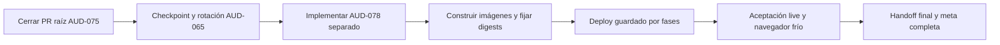

# Plan maestro de finalización de YenHubs

> **Plan histórico detallado.** La meta activa, acotada después de distinguir
> cierre obligatorio y campañas futuras, está en
> `docs/active-goal-plan-2026-07-18.md`. En caso de diferencia de alcance u
> orden, prevalece la meta activa. Este documento se conserva como snapshot de
> estado y evidencia anterior.

Última actualización: 18 de julio de 2026
Estado: **SNAPSHOT HISTÓRICO; NO REANUDAR DESDE ESTE FICHERO**
Siguiente acción: abrir `docs/active-goal-plan-2026-07-18.md` y seguir allí la
primera casilla pendiente.

Este fichero conserva el snapshot detallado que originó la meta acotada. La
fuente de verdad operativa vigente es `docs/active-goal-plan-2026-07-18.md`.
No sustituye las especificaciones técnicas ni la matriz de evidencia.

## Resumen ejecutivo

YenHubs **sigue operativo con el runtime anterior**. El trabajo nuevo no se ha
desplegado todavía y no se ha mutado producción durante `AUD-075`.

| Frente | Estado aproximado | Lectura correcta |
| --- | ---: | --- |
| Investigación, auditoría y diseño | 90% | Avatares, sitting, bots, capacidad y Spoke ya tienen investigación, código o arnés reproducible. |
| Código fuente y pruebas locales | 85% | `AUD-075` está integrado en Cloud y los gates raíz normal y completo pasan. Falta implementar `AUD-078`. |
| Integración Git | 70% | Hubs y Cloud están integrados; falta fusionar el candidato raíz actual y, después, integrar `AUD-078` por separado. |
| Nuevo runtime en producción | 0% | Aún no hay nuevas imágenes, digests, checkpoint, rotación, apply ni aceptación live del candidato. |
| Meta completa | 55-65% | La mayor parte del análisis está hecha; queda menos trabajo en número de fases, pero es la parte operativa de mayor riesgo. |

Resultado buscado: que Hubs, Hubs CE, sitting, bots, IA, privacidad, avatares,
Spoke, backup/restore y despliegue queden coherentes en Git, construidos por
Actions, fijados por digest, desplegados de forma recuperable y aceptados en un
navegador frío con **cero fallos y cero avisos**.

## Punto exacto conservado

No hay subagentes ni comandos largos activos. Los tres subagentes que estaban
actualizando documentación quedaron interrumpidos de forma segura.

| Repositorio | Estado conservado |
| --- | --- |
| Root | Worktree `/Users/Shared/Gits/YenHubs-aud075-root`, rama `codex/aud075-integration`, base `origin/main` en `0657ddcb1e33`. Cambios de `AUD-075` sin commit; solo el gitlink Cloud está staged. |
| Hubs | `master` integrado en `674ece41169117a1a842af9cf5d256a10cc43df0`. |
| Hubs Cloud | `master` integrado en `5392495b077249edcedfb3092551201645f648f1`. PR `#11` a `development` = `ebe960794735`; PR `#12` a `master` = `5392495b0772`. |
| Producción | No tocada por este cierre. Continúa usando el baseline live anterior y el runner `process-local`. |

Validación exacta del candidato raíz antes de la pausa:

- `./scripts/verify-project.sh`: **PASS**.
- `./scripts/verify-project.sh --full`: **PASS**.
- Seguridad raíz: **43/43**.
- Recuperación: **212/212**.
- Verificador de Pods runner: **45/45**.
- Pull/config de imágenes: **19/19**.
- Deployment del orquestador: **18/18**.
- Hubs: **97/97** y build.
- Navegador contractual: **11/11**.
- Capacidad: **115/115**, con ejecución física correctamente bloqueada.
- Bot orchestrator: **128/128**.
- Generador Cloud: **30/30**, inventario exacto de **58 recursos**.
- Dialog: **2/2**; Photomnemonic: **7/7**; Spoke: **68/68** y build.
- Reticulum: **430 tests + 5 properties**, cero fallos.
- Gitleaks, Actionlint, ShellCheck y auditoría upstream: verdes.
- Releases aceptadas: Hubs `prod-2026-03-11`; Hubs CE `2.1.0`; cero commits
  de release estable pendientes.

Registros locales de esta ejecución, no versionados:

- `/tmp/yenhubs-aud075-recovery-full.log`, SHA-256
  `74ee115aede8bcd556bc7c4c50ac36181cdd682317aa2c986532901e50c5db51`.
- `/tmp/yenhubs-aud075-verify-normal.log`, SHA-256
  `f1b5c8052f89d6dd8d58199515ea17d492bcdeb562d340ccaa27334e58f55a7c`.
- `/tmp/yenhubs-aud075-verify-full.log`, SHA-256
  `e49aa1f4a04d2e56bd95e36dcde4b41e828fdca3828f284d18980336ed2b77c2`.

## Qué ya está hecho

### Base, seguridad y upstream

- [x] Leer reglas, handoff, auditoría, changelog, inventario y documentación de
  features.
- [x] Comprobar Git, remotos, ramas y submódulos.
- [x] Auditar las releases estables actuales; no usar `upstream/master` como
  release desplegable.
- [x] Endurecer Gitleaks, ShellCheck, Actionlint, manejo de temporales y
  portabilidad macOS/GNU.
- [x] Mantener fuera de Git los valores privados y los manifiestos generados.

### Avatares

- [x] Investigar Avaturn y alternativas con fuentes oficiales.
- [x] Documentar costes, privacidad, GLB/GLTF, rig, dependencia externa y
  riesgo de proveedor.
- [x] Conservar la subida manual GLB como contrato de producción.
- [x] Integrar un flujo GLB privado neutral a proveedor.
- [ ] Probar el flujo candidato completo en staging y decidir por separado si
  se contrata algún SaaS. No es necesario contratarlo para cerrar el fallback.

### Sitting y ocupación

- [x] Reproducir la carrera del baseline: se observó doble ocupación transitoria.
- [x] Integrar reservas autoritativas Phoenix/PostgreSQL, protocolo 2, lease,
  identidad estable e idempotencia.
- [x] Crear pruebas unitarias y un escenario Playwright con dos contextos.
- [ ] Ejecutar la carrera contra el backend candidato desplegado y comprobar
  visualmente pose remota, stand, reclaim, desconexión, suelo y geometría.

### Bots, IA y privacidad antes de `AUD-075`

- [x] Mantener ghost runner Node como backend de producción y Chromium solo
  como diagnóstico local.
- [x] Integrar readiness autoritativo, Presence autenticada, ACK de spawn,
  navmesh+A*, movilidad, límites de salas/bots y chat privado.
- [x] Integrar GPT-5 Nano, `store:false`, moderación de entrada/salida,
  Structured Outputs, safety ID seudónimo, presupuesto total y lista cerrada
  de acciones.
- [x] Documentar que `store:false` no equivale a Zero Data Retention.
- [x] Integrar `AUD-076`: lease/epoch PostgreSQL y fencing autoritativo.
- [x] Integrar `AUD-077`: aprobación exacta y cuarentena de configuraciones
  heredadas.

### Capacidad y Spoke

- [x] Crear arnés reproducible para 30/100 por sala, 300 totales, modelo de
  10.000 y variantes de 0/5/10 bots.
- [x] Añadir métricas, criterios de parada, procedencia, aislamiento y evidencia
  fail-closed.
- [x] Mantener la ejecución física bloqueada mientras faltan métricas y anclas;
  no presentar capacidad teórica como medida.
- [x] Auditar Spoke sobre Node 16/Yarn 1 y documentar modernización por capas.
- [x] Pasar lint, 68/68 pruebas y build sin upgrade masivo.
- [ ] Aceptar en staging proyecto, publicación, Floor Plan/navmesh, ocho
  `spawbot-*` y los asientos.

### `AUD-075`: aislamiento de runners

- [x] Separar parent y runner en imágenes distintas.
- [x] Crear un Pod endurecido por sala/generación sin provider key, master key,
  token Kubernetes ni autoridad de acciones.
- [x] Añadir namespace dedicado `hcce-bot-runners`, PSA restricted, cuota,
  ServiceAccounts, RBAC mínimo, ValidatingAdmissionPolicy/Binding y ocho
  NetworkPolicies.
- [x] Añadir generación de un solo uso, lease/epoch DB exactos, borrado con
  precondición UID, reconciliación y readiness fail-closed.
- [x] Añadir Lease global para serializar deploy/recovery y activación por
  `bootstrap -> admission -> active` mediante `npm run apply`.
- [x] Fusionar Cloud primero (`#11` y `#12`) y comprobar todo su CI.
- [x] Integrar el gitlink final en el candidato raíz.
- [x] Corregir dos fallos reales detectados por el gate raíz:
  - la limpieza de un helper stale ahora adopta el Lease del padre antes de
    borrar Pod, NetworkPolicy y lock;
  - el fixture ya no comparte un payload temporal entre el heartbeat del Lease
    y otro CAS concurrente.
- [x] Pasar los gates raíz normal y completo sobre los commits finales.

## Trabajo en curso al pausar

- [ ] **EN CURSO, PAUSADO:** terminar de actualizar todos los runbooks y
  documentos activos de `AUD-075`.
- [x] Actualizar `AGENTS.md` para prohibir el `kubectl apply` desnudo y exigir
  el wrapper fail-closed `npm run apply`.
- [ ] Eliminar las últimas referencias vigentes a `0110e9a`, 50 recursos,
  cuentas antiguas y rollout de dos fases, sin reescribir entradas históricas.
- [ ] Revisar que todos los documentos distingan claramente:
  `integrado en Git` != `imagen construida` != `desplegado` != `aceptado live`.

## Secuencia histórica sustituida

> Las casillas y fases de esta sección están congeladas como evidencia del
> análisis anterior. No deben marcarse ni utilizarse para decidir el siguiente
> paso. El orden obligatorio vigente está únicamente en
> `docs/active-goal-plan-2026-07-18.md`.

### Fase 1 — cerrar el PR raíz de `AUD-075`

- [ ] Completar la actualización documental pausada.
- [ ] Ejecutar `rg` de referencias obsoletas y revisar el diff completo.
- [ ] Ejecutar `git diff --check`, Bash/ShellCheck relevantes y Gitleaks final.
- [ ] Confirmar que solo hay cambios pertenecientes a `AUD-075`.
- [ ] Commit del root en `codex/aud075-integration`.
- [ ] Push y PR a `main`.
- [ ] Esperar CI de GitHub y corregir cualquier fallo real.
- [ ] Fusionar el PR raíz.

Resultado de la fase: Hubs `674ece…`, Cloud `5392495…`, scripts de recuperación,
gates y documentación quedan unidos en `main`, pero todavía sin cambiar live.

### Fase 2 — implementar `AUD-078` en una rama separada

- [x] Auditar el defecto y diseñar la solución.
- [ ] Crear rama Cloud nueva desde `master`; no mezclarla con `AUD-075`.
- [ ] Añadir `runtime_revision` durable y outbox PostgreSQL transaccional.
- [ ] Encolar config/stop en la misma transacción que aprobación, cuarentena y
  revoke epoch.
- [ ] Añadir claims recuperables con CAS, expiración, retry y orden estricto por
  sala.
- [ ] Evitar que snapshots atraviesen un stop pendiente.
- [ ] Cambiar el protocolo parent para responder `200 terminal` solo tras
  demostrar ausencia del nombre+UID y cero Pods HMAC de la sala.
- [ ] Cubrir 202, timeout, 2xx legacy, ABA, Pod desconocido, create tardío,
  reinicio y pérdida de claim.
- [ ] Verificar migración real PostgreSQL 12/14, Reticulum, orquestador,
  generador, audits y seguridad.
- [ ] PR Cloud a `development`, promoción a `master`, luego PR del puntero raíz.

Resultado de la fase: Reticulum no puede declarar un stop completado mientras
quede un runner vivo o reaparezca uno con otro UID.

### Fase 3 — construir artefactos publicables

- [ ] Repetir auditoría upstream inmediatamente antes del build.
- [ ] Identificar todas las imágenes cuyo source commit difiere del runtime
  live; no reconstruir ni cambiar imágenes sin relación.
- [ ] Construir únicamente mediante los workflows GitHub Actions aprobados.
- [ ] Exigir que parent y runner procedan del mismo commit Cloud.
- [ ] Esperar CI/build y detenerse ante un fallo de Actions o GHCR; no usar
  builds dentro del cluster ni hotpatches.
- [ ] Capturar digests y fijarlos en los valores privados sin imprimir secretos.
- [ ] Regenerar y verificar el inventario exacto de 58 recursos.

Resultado de la fase: cada imagen candidata tiene procedencia, commit y digest
inmutables; todavía no se aplica nada.

### Fase 4 — checkpoint y rotación de credenciales

- [ ] Confirmar contexto, namespace, UID del namespace, PVC e inventario live.
- [ ] Crear checkpoint nuevo con PostgreSQL **y** `ret-pvc` mediante
  `./deployment/create-checkpoint.sh`.
- [ ] Verificar hashes, contrato DB, pares de storage y restore dry-run.
- [ ] Rotar coordinadamente todas las credenciales afectadas por `AUD-065` sin
  mostrarlas en tarea, terminal o Git.
- [ ] Verificar solo presencia/huellas y paridad `PERMS_KEY` Reticulum/Dialog.
- [ ] Repetir preflight después de la rotación y antes de cualquier apply.

Resultado de la fase: existe rollback completo y las credenciales previamente
expuestas dejan de ser válidas.

### Fase 5 — despliegue fail-closed

- [ ] Generar cada manifiesto desde valores privados; nunca editar `hcce.yaml`.
- [ ] Ejecutar `kubectl diff` de forma privada sin emitir cuerpos de Secrets.
- [ ] Desplegar primero la versión compatible de Reticulum y sus migraciones.
- [ ] Revisar y aprobar individualmente el inventario migrado de `AUD-077`.
- [ ] Activar el control plane runner mediante tres manifiestos regenerados y
  `npm run apply`: `bootstrap`, después `admission`, después `active`.
- [ ] No repetir un `active` que haya pedido refence; volver al flujo publicado.
- [ ] Reiniciar Reticulum si cambia Hubs para invalidar HTML/assets cacheados.
- [ ] Confirmar todos los Deployments por digest, RBAC/admission exactos y cero
  warnings antes de continuar.

Resultado de la fase: el runtime usa fencing DB, Pods aislados y outbox terminal,
con rollback posible y sin ventana de autoridad mixta.

### Fase 6 — aceptación funcional y de privacidad

- [ ] Ejecutar `./deployment/verify-live-reactivation.sh`: 0 fallos, 0 avisos.
- [ ] Navegador frío desktop y móvil: `APP`, `AFRAME`, escena y bots sin errores,
  warnings ni respuestas HTTP anómalas.
- [ ] Sitting con dos navegadores: exclusión, pose remota, stand, reclaim,
  desconexión y fallback.
- [ ] Bots 0/5/10: aparición, rehidratación, máximo, movilidades static/low/
  medium/high, navmesh+A*, separación y Featured.
- [ ] Chat: privado por sesión, GPT-5 Nano, moderación, Structured Outputs,
  rate/token limits, safety ID y acciones allowlisted.
- [ ] Revisar logs de Hubs, Reticulum, parent y runner: ningún prompt, mensaje o
  secreto completo persistido.
- [ ] Probar subida manual GLB privada y el fallback neutral a proveedor.
- [ ] Probar Spoke, publicación, navmesh y waypoints.
- [ ] Solo en staging y con límites firmados: ejecutar las mediciones físicas
  de capacidad permitidas; nunca carga destructiva en producción.

Resultado de la fase: evidencia real del candidato, no solo pruebas locales.

### Fase 7 — cierre

- [ ] Actualizar auditoría, matriz de evidencia, handoff, changelog, inventario,
  capacidad, privacidad y cada feature modificada.
- [ ] Registrar commits, PR, workflows, digests, checkpoint y resultado live sin
  copiar secretos.
- [ ] Confirmar root `main` limpio y los submódulos fijados a sus commits base.
- [ ] Marcar la meta completa únicamente si no queda una casilla obligatoria
  abierta o si un bloqueo externo está documentado sin fingir aceptación.

## Riesgos que siguen abiertos

| Riesgo | Por qué importa | Cierre previsto |
| --- | --- | --- |
| `AUD-065` | Hubo exposición preventiva de valores privados en el registro de una tarea anterior. | Checkpoint y rotación coordinada antes del apply. |
| `AUD-078` | Un 2xx de `room_stop` puede llegar antes de la desaparición terminal del runner. | Outbox transaccional, revisión durable y ACK terminal Kubernetes. |
| Runtime live antiguo | Producción aún no contiene el fencing, aislamiento y aprobación nuevos. | Build, digest, staged apply y atestación. |
| Sitting candidato | El protocolo está integrado, pero falta la carrera real contra el nuevo backend. | Dos navegadores aislados después del rollout. |
| Capacidad física | El arnés está verde, pero faltan 39 métricas/anclas y no hay capacidad certificada. | Staging instrumentado y carga acotada; nunca prometer sin muestras. |
| Dependencias legacy | Hubs/Spoke/Reticulum muestran deuda conocida; un upgrade masivo rompería compatibilidad. | Modernizaciones separadas por superficie, con rollback y pruebas. |

## Reglas históricas sustituidas

Estas reglas explican cómo se preparó el snapshot, pero el protocolo vigente
está en el plan activo y prevalece incluso si una casilla inferior discrepa.

1. Al reanudar, leer primero este fichero y seleccionar solo la primera casilla
   pendiente de la fase activa.
2. No repetir un gate verde si no cambió ninguno de sus inputs. Tras cambios
   solo documentales basta la validación documental/estática; el CI repetirá el
   conjunto completo tras el push.
3. Cada resultado se anota con commit, comando y cuenta exacta. “El proceso
   estaba activo” no sustituye una prueba funcional.
4. Un subrepo se fusiona antes de actualizar su gitlink raíz.
5. `AUD-078`, builds, rotación y deploy son fases distintas; no se mezclan en
   un commit o PR.
6. Si falla Actions, GHCR, generación o apply, se conserva la evidencia y se
   corrige esa causa; no se cambia de método.
7. Producción no se declara sana para el candidato hasta pasar verificador live
   y navegador frío con cero fallos y cero avisos.

## Protocolo vigente de reanudación

Al continuar, no seleccionar ni marcar ninguna casilla de este snapshot. Leer
`docs/active-goal-plan-2026-07-18.md`, confirmar el estado conservado y reanudar
desde su primera casilla pendiente. Ese fichero es el único plan operativo y la
memoria persistente de la meta actual.
